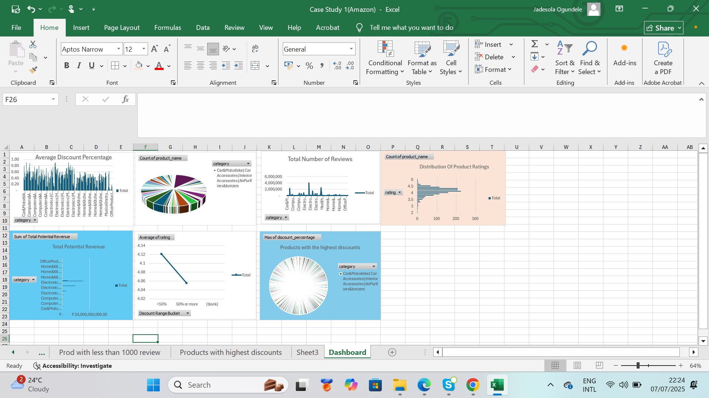

 # Amazon Retail Report - Sales, Discount & Customer Review Analysis
 ## Overview
This analysis Shows Amazon product data, focusing on pricing strategy, customer reviews, ratings, and potential revenue across various product categories. The goal of this analysis is to uncover trends and make informed suggestions to improve sales performance and customer satisfaction.

## What Was Done
- Data Cleaning
The raw dataset was cleaned by removing inconsistent, irrelevant columns, and empty rows.

- Average Discount Analysis: 
I was able to identify categories with high or low discount by calculating the average discount percentage per product category.

- Product Volume by Category: 
I summed the number of products listed under each category to understand distribution.

- Customer Review Insights: 
I extracted products with the highest number of reviews and also Aggregated the total number of reviews per category to gauge customer engagement.

- Top-Rated Products: 
I was able to Identify products with the highest average ratings.analyzed their price points, discount levels and review quality.

- Price vs Discount Comparison:
I calculated the average discounted price and Compared actual vs discounted prices across categoriesto identify perceived value offered to customers.

- High Discount Products: 
I was able to identify over 600 products and categories offering 50% discounts or more, an indication ofaggressive price cuts.

- Rating Distribution: 
I Categorized products based on rating buckets (e.g. 2.0–5.0) to assess customer satisfaction.

- Revenue Estimation: 
I Calculated Total Potential Revenue using discounted price and review volume and categories like "Computers & Accessories" showed the highest revenue potential.

- Product Diversity by Price Bucket:
I Segregated products by their price ranges (e.g. <₹200, ₹200–₹500, >₹500).

- Discount vs Rating Relationship:
I discovered by Comparing ratings across products with <50% and ≥50% discounts that extremely discounted products tend to have slightly lower average ratings.

- Low-Reviewed Products: 
I extracted well-rated products with under 1000 reviews—potential for improved visibility.

The dashboard showcases all the questions posed earlier 

# Key Recommendations for Amazon
- Pricing for Mid-Tier Products should be optimized

- Products in the ₹200–₹500 range are on the high side and rated well, and should therefore be promoted via sponsored listings.

- Reevaluate High Discounts

- Reduce unnecessary high discounts for well-rated, high-selling items in order to increase margins.

- Boost Visibility of Low-Reviewed Products

- Implement targeted campaigns to promote quality products with <1000 reviews.

- Balance Product Categories

- Reduce oversaturation in categories like “Accessories & Peripherals” while promoting underrepresented segments.

- Use Ratings in Promotion Strategy

- Highlight high-rated products with moderate discounts in marketing emails or deals pages.

- Bundle Slow-Moving Products

- Combine low-selling, highly discounted items with popular products to boost conversion rates.

- Encourage Reviews Strategically

- Introduce incentives (such as coupons, loyalty points) for leaving reviews on new or under-reviewed products.

# Conclusion
This analysis provides insights into product performance, customer engagement, and pricing efficiency. By implementing the recommendations above, Amazon can better align its strategies for improved profitability, customer satisfaction, and operational efficiency.

# Analyst Name: Jadesola Ogundele
# Tools Used: Microsoft Excel
# LinkedIn:www.linkedin.com/in/jadesolaogundele 
